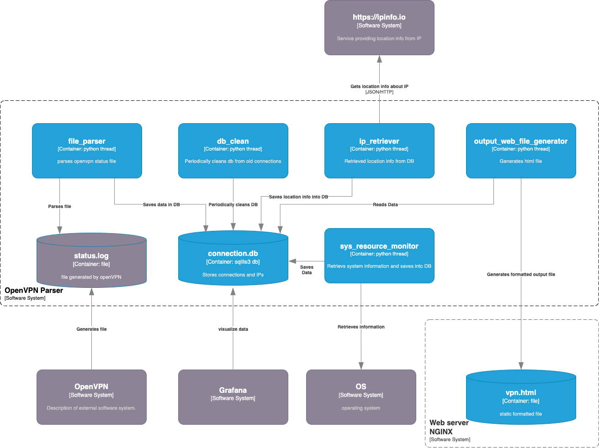

# OpenVPN Statistics

The **OpenVPN Statistics** is a Python script designed to parse OpenVPN status data, track user connections, and generate an output file with connection statistics.

## Table of Contents

- [Overview](#overview)
- [Installation](#installation)
- [Usage](#usage)
- [Configuration](#configuration)
- [License](#license)

## Overview



The OpenVPN Statistics consists of a set of Python scripts that work together to achieve the following tasks:

1. **Parsing OpenVPN Status**: The script utilizes the `OpenVpnParser` class to parse OpenVPN status data from a specified input file.

2. **Storing Connections**: It uses the `ConnectionDB` class to manage connection information and store data in a database.

3. **Generating Connection Statistics**: The script generates connection statistics for each user, including **daily**, **weekly**, and **monthly** data usage. These statistics are then formatted and written to an output text file and html file.

output file format: 
```bash
    User1    104 kB   21 kB  427 kB  129 kB  427 kB  129 kB 23-08-21 16:13 
    User2    936 MB   53 MB 5.29 GB  147 MB 5.29 GB  147 MB 23-08-21 18:44 
    User3    539 MB   27 MB 7.84 GB  288 MB 7.84 GB  288 MB 23-08-21 19:00 
    User4    263 MB   16 MB 1.06 GB   72 MB 1.06 GB   72 MB 23-08-21 18:59 
    User5    677 MB   11 MB 4.67 GB  236 MB 4.67 GB  236 MB 23-08-21 16:32 
```

html file:


## Installation

1. Clone this repository to your local machine.

   ```bash
   git clone https://github.com/wocsom92/openvpnstatistics.git

## Usage

1.) Configure the script by modifying the config.py file to set your desired input and output file names, as well as other parameters.

2.) Run the main script to start monitoring OpenVPN connections and generating statistics. Program will run in 4 threads. 
    
```bash
    python3 main.py
```

The script will run indefinitely, parsing OpenVPN status data at specified intervals and generating the connection statistics output.

## Configuration

You can customize the behavior of the OpenVPN Connection Monitor by modifying the parameters in the `config.py` file. Here are some of the configurable options:

- `inputFileName`: Name of the input file containing OpenVPN status data, usually '/var/log/openvpn/status.log'
- `inputFileParseInterval`: Interval (in seconds) at which the script should parse OpenVPN status data.
- `dbFileName`: Name of the output connection database file.
- `outputFileName`: Name of the output file for connection statistics.
- `outputFileWriteInterval`: Interval (in seconds) at which the script should generate and update the output file.
- `db_clean_interval`: Interval (in seconds) at which the script should clean and vacuum db.
- `db_clean_how_many_days_keep_data`: Interval (in days) at which the script should keep connections data db.
- `ip_update_interval`: Interval (in seconds) at which the script should update ip locations data.
- `webFilePath`: Name and location of the output file for example: '/var/www/html/vpn.html'

## License

This project is licensed under the MIT License.

