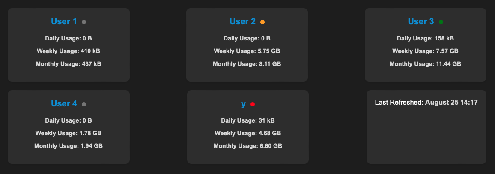

# OpenVPN Statistics

The **OpenVPN Statistics** is a Python script designed to parse OpenVPN status data, track user connections, and generate an output file with connection statistics.

## Table of Contents

- [Overview](#overview)
- [Installation](#installation)
- [Usage](#usage)
- [Configuration](#configuration)
- [License](#license)

## Overview


The OpenVPN Statistics consists of a set of Python scripts that work together to achieve the following tasks:

1. **Parsing OpenVPN Status**: The script utilizes the `OpenVpnParser` class to parse OpenVPN status data from a specified input file.

2. **Storing Connections**: It uses the `ConnectionDB` class to manage connection information and store data in a database.

3. **Generating Connection Statistics**: The script generates connection statistics for each user, including **daily**, **weekly**, and **monthly** data usage. These statistics are then formatted and written to an output text file and html file.

html file:



## Installation

1. Clone this repository to your local machine.

   ```bash
   git clone https://github.com/wocsom92/openvpnstatistics.git

## Usage

1.) Configure the script by modifying the config.py file to set your desired input and output file names, as well as other parameters.

2.) Run the main script to start monitoring OpenVPN connections and generating statistics. Program will run in 4 threads. 
    
```bash
    python3 main.py
```

The script will run indefinitely, parsing OpenVPN status data at specified intervals and generating the connection statistics output.

## Configuration

You can customize the behavior of the OpenVPN Connection Monitor by modifying the parameters in the `config.py` file. Here are some of the configurable options:

### Input file

- `input_file_name`: Name of the input file containing OpenVPN status data, usually '/var/log/openvpn/status.log'
- `input_file_parse_interval`: Interval (in seconds) at which the script should parse OpenVPN status data.

### Output file

- `db_file_name`: Name of the output connection database file.
- `db_file_location`: Location of database file.
- `output_file_write_interval`: Interval (in seconds) at which the script should generate and update the output file.

### DB clean functionality

- `db_clean_interval`: Interval (in seconds) at which the script should clean and vacuum db.
- `db_clean_how_many_days_keep_data`: Interval (in days) at which the script should keep connections data db.

### Ip Retrieving
- `ip_update_interval`: Interval (in seconds) at which the script should update ip locations data.

### Html output file

- `web_file_path`: Name and location of the output file for example: '/var/www/html/vpn.html'
- `enable_provider_in_web`: Enables providers to be listed in the web
- `enable_full_user_name_in_web`: Enables full udser name to be shown, if false, just first letter is shown
- `ip_information_shown_in_web`: Enables ip informations to be shown in the web

### System monitoring 
- `sys_update_interval`: Interval (in seconds) at which the script will retrieve system information.
- `disk_to_monitor`: path to disk which should be monotired (same path as in df command)

## Database structure 

### Table Descriptions

#### Table 1: `connections`

- **Purpose**: Stores information about network connections.
- **Columns**:
  - `common_name` (TEXT): The connection's common name.
  - `real_address` (TEXT): The real address of the connection.
  - `bytes_received` (INTEGER): Total bytes received.
  - `bytes_sent` (INTEGER): Total bytes sent.
  - `connected_since` (DATETIME): Connection start time.
  - `db_updated` (DATETIME): Last database update time.
  - `ip_id` (INTEGER): Associated IP address identifier.
- **Primary Key**: `common_name` and `connected_since`.

#### Table 2: `ips`

- **Purpose**: Stores IP address information.
- **Columns**:
  - `id` (INTEGER): Unique identifier (auto-incremented).
  - `ip` (TEXT): The IP address.
  - `city` (TEXT): Associated city.
  - `region` (TEXT): Associated region or state.
  - `country` (TEXT): Associated country.
  - `table_updated` (DATETIME): Last database update time.
  - `provider` (TEXT): IP provider information.
- **Primary Key**: `id`.

#### Table 3: `system_resources`

- **Purpose**: Records system resource usage.
- **Columns**:
  - `table_updated` (DATETIME): Last database update time.
  - `disk_percentage` (INTEGER): Disk usage percentage.
  - `memory` (INTEGER): Memory (RAM) usage.
  - `load_average_1` (REAL): 1-minute load average.
  - `load_average_5` (REAL): 5-minute load average.
  - `load_average_15` (REAL): 15-minute load average.
  - `proc_no` (INTEGER): Number of running processes.
- **Primary Key**: None specified.


## License

This project is licensed under the MIT License.

